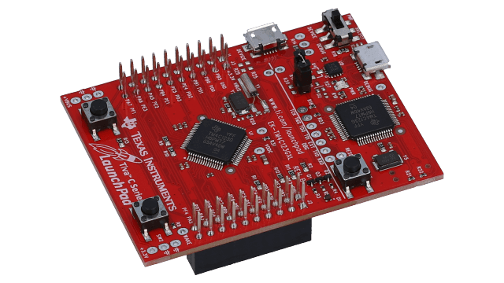

# :pager::desktop_computer: Organização de Computadores

## ℹ Tabela de Conteúdos
- [Descrição do Projeto](#dart-projetos-da-cadeira-de-organização-de-computadores-20222)
- [Especificações](#-especificações-do-projeto)
- [Projeto 1: Hibernation Module](hibernation-module)
- [Projeto 2: PWM](pwm)

## :dart: Projetos da Cadeira de Organização de Computadores 2022.2

Apresentar ao estudante conceitos básicos de organização de computadores, capacitando-o a melhor compreender o desenvolvimento das tecnologias de processadores, barramentos, dispositivos de armazenamento e de entrada e saída.

  

> Tiva-C Launchpads é uma plataforma de prototipagem eletrônica de microcontroladores criado pela Texas Instruments. As placas são do tamanho aproximado de um cartão de crédito. São equipadas com um microcontrolador ARM Cortex-M4F CPU de 32 bits operando a 80 a 120 MHz, fabricado pela Texas Instruments.

## 📃 Especificações do Projeto

Especificações incluem:
- TM4C123G LaunchPad™ Evaluation Kit
- Code Composer Studio
- TivaWareTM for C Series
- Workshop Lab Files
- Windows-side USB Examples

Para mais informações acesse: [Texas Instruments](https://www.ti.com/tool/EK-TM4C123GXL?utm_source=google&utm_medium=cpc&utm_campaign=epd-null-amcu-prodfolderdynamic-cpc-pf-google-wwe&utm_content=ARM-Based_MCUs&ds_k=DYNAMIC+SEARCH+ADS&DCM=yes&gclid=Cj0KCQjw3IqSBhCoARIsAMBkTb2b9dZoKOjV2DTKxAUZXPILlrQatNIpng9SMRCR0GvCeqmkGJtjLJIaAhpIEALw_wcB&gclsrc=aw.ds)

## 📝 Licença

Esse projeto está sob licença. Veja o arquivo [LICENÇA](LICENSE) para mais detalhes.

[⬆ Voltar ao topo](#pagerdesktop_computer-organização-de-computadores) 
