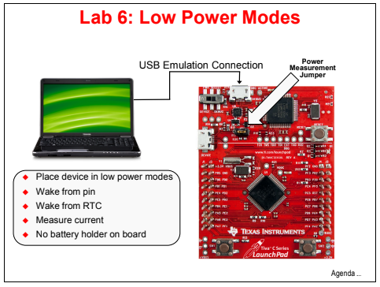

# Hibernation Module

## 🎯 Proposta
Neste projeto, usaremos o módulo de hibernação para colocar o dispositivo em um estado de baixo consumo de energia. Então nós vamos acordá-lo através do pino de ativação e do relógio em tempo real (RTC). Também mediremos o consumo de corrente para ver os efeitos dos diferentes modos de energia.

  

> Visualização da placa e atividades realizadas no projeto

## ☕ Usando o Hibernation Module

## 🏆 Resultados

[⬆ Voltar ao topo](#hibernation-module)
