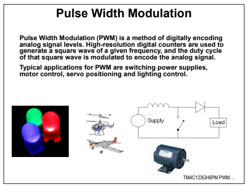

# PWM (Pulse Width Modulation - Modulação por largura de pulso)

## 🎯 Proposta
Neste projeto, usaremos o PWM no TIVA C para controlar a intensidade de luz de um LED. Em outras palavras, iremos controlar o valor da alimentação entregue ao LED e, portanto, variar sua potência através de manipulações no ciclo de trabalho do sistema.

  

> Visualização da placa e atividades realizadas no projeto

## ☕ Usando o PWM

## 🧑‍🏫 Material de Apresentação
- Google Slides: [Grupo 3 - PWM](https://docs.google.com/presentation/d/1Q2JF3QSCywo8wbGO-fFECHDjjYlA4K3Af3v8qYpoJRc/edit?usp=sharing)

## 🏆 Resultados

[⬆ Voltar ao topo](#pwm-pulse-width-modulation---modulação-por-largura-de-pulso)
